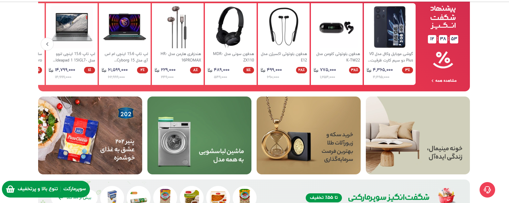

<h1 align="center">Freeshop project</h1>
<h3 align="center">A Sample shop for educational purposes and use for template while making a real online store</h3>
<p align="center">

</p>
 
# Guideline
- [Guideline](#guideline)
- [Goal](#goal)
- [Description](#Description)
- [Technology](#Technology)
- [Challenges](#Challenges)
- [To Run the project](#Runing)
- [Demo](#demo)
- [Curriculum](#curriculum)
- [Bugs](#bugs)


# Goal

This is a sample project to show you how to create a ecommerce website, and how to interact with users and payment gateway and also how to manage orders and products.

# Description
**our Freeshop is enough big project** and it is like a [bigshop](https://freeshop.io/@bigshop)
we try our best to provide the excellent services by this online store.
*such as creating comfortable environment for our cutomers to easily order and buy the product online.
and also making sure they receive the product as soon as possible.*

# Technology
our Team uses the latest technologies for designing a website, to be able to provide the excellent services.
we use technologies such as HTML-CSS-Bootstrap for front-end, and django for beck-end.

# Challenges
creating excellent services is not always easy, it has challenges.
our Team had both frond-end and back-end challenges.

# To Run the project
```bash
Fork and clone the project


```

```python
Upgrade and Develope the project
```


# Demo

the picture will show you a demo of the project and what are the capabilities and what features are included.

<p align="center">
</a>
</p>


# Curriculum

here are the course and project main curriculum

- introduction (phase 1)
- project setup
- authentication and authorization
- create shop and products
- manage and create cart
- users dashboard based and pages
- product and inventory management
- session and db management of cart
- order and total price calculation
- integration with payment gateway
- order management
- wishlist management
- review management
- next steps to learn (and know phase 2)


# Bugs
Feel free to let us know if something needs to be fixed. or even any features seems to be needed in this repo.
